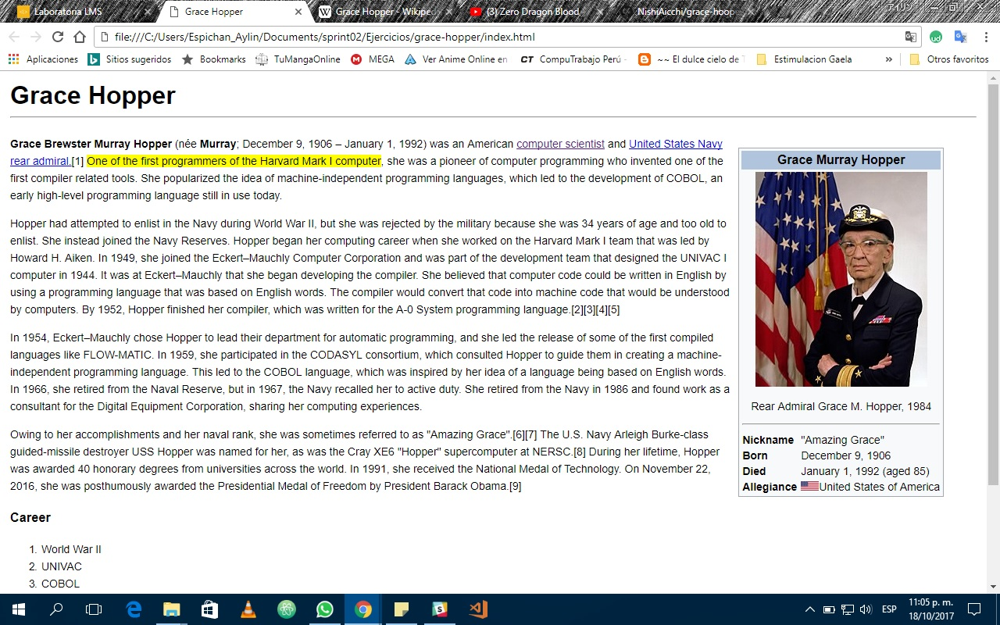

# Ejercicio: Grace Hooper
## Objetivo:
+ *hacer una replica de la biografia de Grace Hooper en Wikipedia utilizando los conocimientos aprendidos en el self learning.*

__Referencia__: <https://en.wikipedia.org/wiki/Grace_Hopper>.
### Herramientas:
1. HTML
2. CSS

